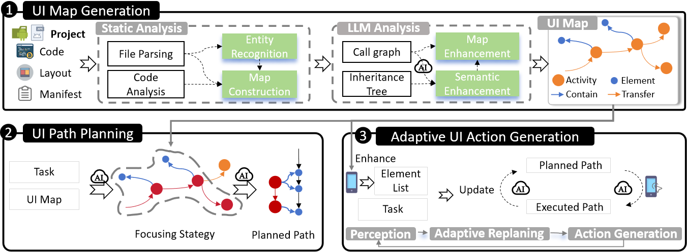
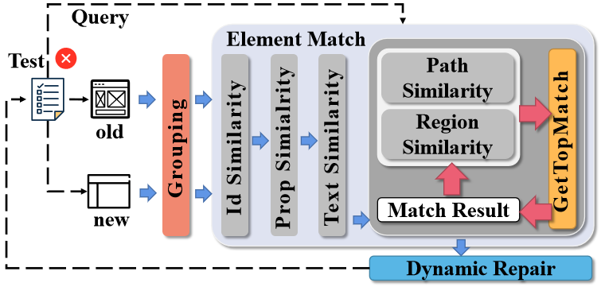

<!-- 




 -->

Currently researching in the field of software testing.

<!-- Lorem ipsum dolor sit amet, consectetur adipiscing elit. Vivamus ornare aliquet ipsum, ac tempus justo dapibus sit amet. Suspendisse condimentum, libero vel tempus mattis, risus risus vulputate libero, elementum fermentum mi neque vel nisl. Maecenas facilisis maximus dignissim. Curabitur mattis vulputate dui, tincidunt varius libero luctus eu. Mauris mauris nulla, scelerisque eget massa id, tincidunt congue felis. Sed convallis tempor ipsum rhoncus viverra. Pellentesque nulla orci, accumsan volutpat fringilla vitae, maximus sit amet tortor. Aliquam ultricies odio ut volutpat scelerisque. Donec nisl nisl, porttitor vitae pharetra quis, fringilla sed mi. Fusce pretium dolor ut aliquam consequat. Cras volutpat, tellus accumsan mattis molestie, nisl lacus tempus massa, nec malesuada tortor leo vel quam. Aliquam vel ex consectetur, vehicula leo nec, efficitur eros. Donec convallis non urna quis feugiat.

My research interest includes neural machine translation and computer vision. I have published more than 100 papers at the top international AI conferences with total <a href='https://scholar.google.com/citations?user=DhtAFkwAAAAJ'>google scholar citations <strong>260000+</strong></a> (You can also use google scholar badge ). -->

# 🔥 News
- *2025*: &nbsp;🎉🎉 Our paper **"UICOMPASS: UI Map Guided Mobile Task Automation via Adaptive Action Generation"** has been accepted by the EMNLP'25 research papers track (Main conference). 
- *2023.08*: &nbsp;🎉🎉 Our paper **"Automated Fixing of Web UI Tests via Iterative Element Matching"** has been accepted by the ASE'23 research papers track. 

# 📝 Publications 

<!--EMNLP2025-->

EMNLP 2025

<h3><strong>UICOMPASS: UI Map Guided Mobile Task Automation via Adaptive Action Generation</strong></h3>

**Yuanzhang Lin**, Zhe Zhang, Rui He, Qingao Dong, Mingyi Zhou, Jing Zhang, Xiang Gao*, Hailong Sun*

<strong></strong>
- Web UI test cases are employed to Mobile task automation is an emerging technology that leverages AI to automatically execute routine tasks by users' commands on mobile devices like Android, thus enhancing efficiency and productivity. 
While large language models (LLMs) excel at general mobile tasks through training on massive datasets, they struggle with app-specific workflows. 
To solve this problem, we designed UI Map, a structured representation of target app's UI information...
<!-- We further propose a UI Map-guided LLM-based approach UICOMPASS to automate mobile tasks.
Specifically, UICOMPASS first leverages static analysis and LLMs to automatically build UI Map from either source codes of apps or byte codes (\emph{i.e.,} APK packages).
During task execution, UICOMPASS mines the task-relevant information from UI Map to feed into the LLMs, generates a planned path, and adaptively adjusts the path based on the actual app state and action history.
Experimental results demonstrate that UICOMPASS achieves a 15.87\% higher task executing success rate than SOTA approaches.
Even when only APK is available, UICOMPASS maintains superior performance, demonstrating its applicability to closed-source apps. -->

<!--ASE23-->

ASE 2023

<h3><strong>Automated Fixing of Web UI Tests via Iterative Element Matching</strong></h3>

**Yuanzhang Lin**, Guoyao Wen, Xiang Gao*

<strong></strong>
- Web UI test cases are employed to automatically test web applications. 
<!-- - When a web application undergoes updates, these UI tests need to be updated as well to perform regression testing on the new version of the web application.  --> However, keeping UI tests up-to-date can be a tedious and time-consuming task due to the rapid evolution of web applications. Consequently, there has been increasing attention on automatically repairing web UI tests to address these challenges. To address these issues, we propose UITESTFIX, an approach based on a novel iterative matching algorithm aimed at improving the accuracy of UI element matching. 
<!-- UITESTFIX is designed based on two main insights: (1) the relations between different elements can provide guidance in the matching process, and (2) the results of previous iterations can inform the matching process in the current iteration.  -->
<!-- Our evaluation using publicly available datasets and two industrial apps demonstrates that UITESTFIX outperforms four existing approaches by achieving more accurate element matching and producing more correct fixes. -->

<!-- - [Lorem ipsum dolor sit amet, consectetur adipiscing elit. Vivamus ornare aliquet ipsum, ac tempus justo dapibus sit amet](https://github.com), A, B, C, **CVPR 2020** -->

<!-- # 🎖 Honors and Awards -->
<!-- - *2021.10* Lorem ipsum dolor sit amet, consectetur adipiscing elit. Vivamus ornare aliquet ipsum, ac tempus justo dapibus sit amet.  -->
<!-- - *2021.09* Lorem ipsum dolor sit amet, consectetur adipiscing elit. Vivamus ornare aliquet ipsum, ac tempus justo dapibus sit amet.  -->

<!-- # 📖 Educations -->
<!-- - *2019.06 - 2022.04 (now)*, Lorem ipsum dolor sit amet, consectetur adipiscing elit. Vivamus ornare aliquet ipsum, ac tempus justo dapibus sit amet.  -->
<!-- - *2015.09 - 2019.06*, Lorem ipsum dolor sit amet, consectetur adipiscing elit. Vivamus ornare aliquet ipsum, ac tempus justo dapibus sit amet.  -->

<!-- # 💬 Invited Talks -->
<!-- - *2021.06*, Lorem ipsum dolor sit amet, consectetur adipiscing elit. Vivamus ornare aliquet ipsum, ac tempus justo dapibus sit amet.  -->

# 💻 Internships
- *2021.07 - 2023.05*, Huawei, China.